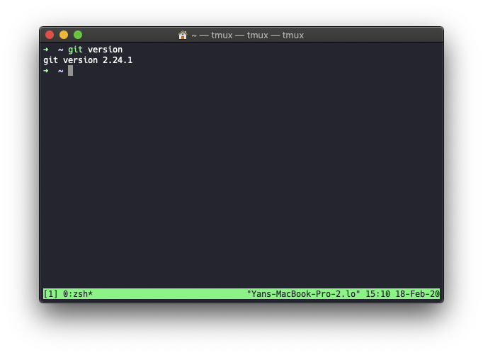

# Persiapan Awal

## Tujuan Pembelajaran

Setelah praktikum ini dilakukan Anda diharapkan dapat:

* Mengingat dan mendemonstrasikan beberapa perintah `Git` yang penting untuk melakukan pekerjaan individu.
* Mempersiapkan `Git repository` lokal dan online pada `Github`.
* Menghubungkan `repository lokal` dan `online.`
* Menginstall Git Sesuai Sistem Operasi.

## Install Git dan Konfigurasi Awal

1. #### Cara Install Git di Linux

Instalasi Git pada Distro keluarga Debian dapat menggunakan perintah `apt`

```shellscript
sudo apt install git

atau

sudo apt-get install git

pada Fedora

yum install git
```
Setelah itu coba periksa versi yang terinstall dengan perintah:

`git version`

Pada laptop saya, versi yang terinstall adalah versi `2.24.1`



2. #### Cara Install Git di Windows

Instalasi Git di Windows memang tidak seperti di *Linux/Mac* yang ketik perintah langsung terinstal.

Kita harus men-download dulu, kemudian melakukan instalasi *next>next>finish.*

Tapi dalam instalasi tersebut, ada pilihan yang harus diperhatikan agar perintah *git dapat dikenali di CMD.*

* Download Git
  
Silahkan buka website resminya Git (git-scm.com). Kemudian unduh Git sesuai dengan arsitektur komputer kita. Kalau menggunakan 64bit, unduh yang 64bit. Begitu juga kalau menggunakan 32bit.


* Klik dua kali file installer untuk penginstal.
  


* Izinkan aplikasi untuk melakukan perubahan pada perangkat Anda dengan mengklik `Yes` pada dialog Kontrol Akun Pengguna yang terbuka.


* Tinjau Lisensi Publik Umum GNU, dan ketika Anda siap untuk menginstal, klik Berikutnya .


*  Installer akan meminta Anda untuk memilih lokasi pemasangan. Biarkan **default**, kecuali Anda punya alasan untuk mengubahnya, dan klik **Next**.


*  Layar pemilihan komponen akan muncul. Biarkan **default** kecuali Anda memiliki kebutuhan khusus untuk mengubahnya dan klik **Next**.


* Installer akan menawarkan untuk membuat folder menu. Cukup klik **Next**.


* **Pilih editor teks** yang ingin Anda gunakan dengan **Git**. Gunakan menu drop-down untuk memilih Notepad ++ (Saya sarankan pakai editor text [`VISUAL STUDIO CODE`](https://code.visualstudio.com)) dan klik **Next** .

* Langkah instalasi ini memungkinkan Anda untuk mengubah **PATH environment**. **PATH** adalah kumpulan direktori default yang disertakan saat Anda menjalankan perintah dari baris perintah. **Biarkan ini pada pilihan tengah (disarankan)** dan klik **Next**.


* *Server Certificates, Line Endings and Terminal Emulators* Opsi selanjutnya terkait dengan sertifikat server. Sebagian besar pengguna harus menggunakan default. Jika Anda bekerja di lingkungan **Active Directory**, Anda mungkin perlu beralih ke sertifikat Windows Store. **Klik Next**.


* Pilihan berikutnya mengubah akhir baris. Dianjurkan agar Anda memilih pilihan **default.** Ini terkait dengan cara data diformat dan mengubah opsi ini dapat menyebabkan masalah. **Klik Next**.


* **Pilih terminal Emulator** yang ingin Anda gunakan. Direkomendasikan **MinTTY default**, untuk fitur-fiturnya. **Klik Next**.


* **Opsi Kustomisasi Tambahan** Opsi default direkomendasikan, namun langkah ini memungkinkan Anda untuk memutuskan opsi tambahan mana yang ingin Anda aktifkan. Jika Anda menggunakan `symbolic links`, yang seperti pintasan untuk baris perintah, centang kotak. **Klik Next**.


* Bergantung pada versi Git yang Anda pasang, mungkin menawarkan untuk menginstal fitur eksperimental. Opsi untuk memasukkan opsi interaktif ditawarkan. Kecuali jika Anda ingin berexperimental, untuk opsi ini biarkan tidak dicentang dan **klik Instal** .


* *Complete Git Installation Process*: Setelah instalasi selesai, centang kotak untuk melihat **Release Notes atau Launch Git Bash**, lalu klik Finish .


* How to Launch Git in Windows

```text
Git memiliki dua mode penggunaan - bash scripting shell (or command line) and a graphical user interface (GUI).
```

* Launch Git Bash Shell
  
Untuk launch `Git Bash,` buka menu `Start Windows` , ketik `git bash` dan tekan Enter (atau klik ikon aplikasi).


* Launch Git GUI

Untuk launch `Git GUI`, buka menu Start Windows , ketik `git gui` dan tekan Enter (atau klik ikon aplikasi).


----

1. Mulailah dengan `command-prompt` atau `shell` favorit Anda. Jika menggunakan Windows, jalankan `Git Bash` atau `cmd` (hanya berlaku jika Anda telah menambahkan path Git yang dapat dieksekusi ke dalam PATH *environment Variable*). 
2. Jika menggunakan OS berbasis Unix (Linux atau Mac OS), dapat menggunakan `shell` yang disediakan di OS, misalkan `bash,ZSH`

🔥 **NOTE**:
##### <span style="font-family:Knack; font-size:0.7em;"> Meskipun dimungkinkan untuk menggunakan aplikasi berbasis GUI, misalkan built-in Git GUI, GitKraken, atau SourceTree, saya sangat menyarankan untuk menggunakan perintah Git dari shell</span>.

#### <p style='text-align: justify;'> <span style="font-family:Knack; font-size:0.6em;"> Shell adalah lingkungan denominator umum terendah yang tersedia untuk Anda selama pengembangan Web, terutama ketika harus menerapkan aplikasi Web ke remote server. Akan berguna juga untuk mengetahui perintah-perintah shell atau Git, ketika kita tidak dapat memiliki lingkungan grafis. Plus, mengeksekusi perintah dengan mengetik jauh lebih cepat daripada point-and-click pada GUI.</span></p>


1. Atur *path* pada terminal Anda saat ini ke *folder* tempat Anda akan menyimpan pekerjaan. Gunakan perintah `cd` untuk navigasi ke *folder* pilihan Anda.
2. Buat folder *baru* untuk menyimpan file baru yang terkait dengan praktikum pada dokumen ini. Coba berikan penamaan `git-exercise` pada *folder* Anda dan atur *path* pada *terminal* Anda saat ini ke folder yang baru saja dibuat.
3. Di dalam *folder* baru, ketikkan perintah ```git init``` untuk membuat `Git repository` kosong.
4. Kemudian coba ketikkan perintah `git status` untuk melihat status dari `Git repository (Git repo)` pada saat perintah dijalankan.

> Sampai pada tahap ini Anda sudah berhasil membuat `Git repository lokal pertama Anda`. Sebelum melanjutkan praktikum, ada beberapa konfigurasi yang perlu dilakukan pada `Git repo lokal Anda.`

6. Atur *username* dan *email* yang akan terhubung dengan pekerjaan Anda pada *Git repository*.

```markdown
 git config user.name "<NAME>" 
 git config user.email "<EMAIL>"
 ```
 **Contoh:**
 
 ```markdown
git config user.name "Nama_Anda"
git config user.email "A3.xxxx@mhs.stmik-sumedang.ac.id"
```
7. Jika koneksi Anda melalui *proxy*, misalkan Anda menggunakan PC pada Lab STMIK SUMEDANG Anda harus mengatur HTTP *proxy* pada konfigurasi Git:


